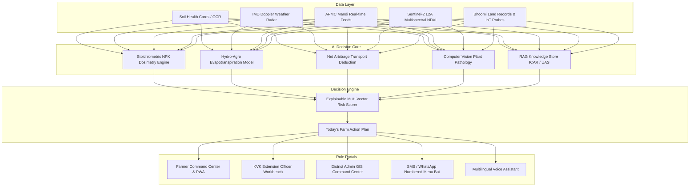

# 🌾 KrishiMitra AI (ಕೃಷಿಮಿತ್ರ / कृषिमित्र)
### AI-Powered Smart Agriculture & Farmer Decision Support Ecosystem

[](https://nextjs.org/)
[](https://react.dev/)
[](https://fastapi.tiangolo.com/)
[](https://supabase.com/)
[](https://opensource.org/licenses/MIT)
[](#)

---

## 📖 1. Product Vision & Core Philosophy

**KrishiMitra AI** is NOT a generic agricultural information directory. It is an **explainable, closed-loop daily decision engine** built to solve the fragmentation of Indian agriculture.

### The Problem in Indian Agriculture:
Indian farmers currently receive fragmented signals from disconnected sources:
- Weather apps show raw rainfall in mm without crop-specific advice.
- Mandi portals display price sheets without deducting transport and loading overheads.
- Soil testing cards deliver NPK ppm numbers without actionable basal/top-dress split schedules.
- Disease detection tools give chemical names without checking if upcoming rain will wash the spray away.

### The KrishiMitra Principle:
> **"Do not just provide information. Convert agricultural data into prioritized, personalized, daily actionable decisions that answer: What should this farmer do today?"**

---

## 🏗️ 2. Architectural Diagram



---

## ✨ 3. Flagship Capabilities & Highlights

### 1. Today's Farm Action Plan
- Delivers 3-5 prioritized actions with explicit **WHY** rationale.
- Real-time weather and crop phenology integration (e.g. *"Skip afternoon irrigation because 18.5mm rain is forecasted at 4:30 PM with 84% probability"*).

### 2. Live APMC Mandi Arbitrage & "Where Should I Sell?"
- Real-time price comparison across local vs regional APMC markets (Kolar, Bengaluru Yeshwantpur, Chintamani, Madanapalle).
- Automatically calculates and deducts distance-based transport costs and handling charges to reveal true **Net Realization / Quintal**.

### 3. AI Crop Disease Pathology Scanner
- Browser-based camera dropzone with laser HUD scan animation.
- Computer vision detection of 48+ crop pathogens (Early Blight, Late Blight, ToLCV, Tikka Spot).
- Dual-track Integrated Pest Management (IPM): Organic/biological controls first, followed by safe fungicide dosages.

### 4. Soil Health Card & Stoichiometric Dosimetry
- Interactive circular gauges for N, P, K, pH, Organic Carbon, and Salinity.
- Precision fertilizer splitter calculating exact bag requirements (Urea, DAP, MOP) across Basal, Peak Vegetative, and Flowering stages.

### 5. Multi-Zone Field Digital Twin & Telemetry
- 4-zone field modeling with simulated LoRaWAN soil moisture probes (Zone A, B, C, D).
- Multispectral NDVI / NDRE vegetation vigor monitoring.
- Drone inspection flight safety checks and wind threshold gates.

### 6. Multilingual Accessibility & Voice AI
- Instant switching between **English**, **Hindi (हिंदी)**, and **Kannada (ಕನ್ನಡ)**.
- Web Speech API integration for bidirectional voice dialogue.
- High-contrast Dark Mode with full design token parity.

---

## 📁 4. Project Structure

```
krishimitra-ai/
├── src/
│   ├── app/                      # 56 Next.js App Router Routes
│   │   ├── page.tsx              # 14-Section Landing Page + 3D Canvas
│   │   ├── dashboard/            # Farmer Command Center
│   │   ├── crops/                # Crop Catalog & 5-Factor AI Scorer
│   │   ├── disease/              # Disease Hub & Leaf Camera Scanner
│   │   ├── market/               # Mandi Prices & Arbitrage Calculator
│   │   ├── soil/                 # Soil Health Hub & Fertilizer Splitter
│   │   ├── pests/                # IPM Pest Defense & Trap Protocols
│   │   ├── digital-twin/         # 4-Zone Field Telemetry & Drone Checks
│   │   ├── weather/              # 7-Day Forecast & IMD Radar Alerts
│   │   ├── irrigation/           # Smart Drip Controller & Water Balance
│   │   ├── schemes/              # PM-KISAN, PMKSY, PM-KUSUM DBT Tracker
│   │   ├── finance/              # Digital Ledger & Profitability Simulator
│   │   ├── insurance/            # PMFBY Satellite Damage Claim Center
│   │   ├── expert/               # KVK Scientist Diagnostic Workbench
│   │   ├── admin/                # District GIS Command Map & Outbreak Center
│   │   └── api/                  # Backend API Route Handlers
│   ├── components/               # 18 High-Aesthetic UI & 3D Components
│   ├── lib/
│   │   ├── store.tsx             # Central React Context Store
│   │   ├── i18n.ts               # Multi-Language Translation Dictionary
│   │   ├── demo-data.ts          # Deterministic Karnataka Kolar Dataset
│   │   └── ai-engine.ts          # 18-Tool RAG Execution Core
├── backend/                      # Python FastAPI ML Microservice
│   ├── main.py                   # REST API & ML Predictors
│   └── requirements.txt          # Python Dependencies
├── supabase/
│   └── schema.sql                # 35+ PostgreSQL Tables with RLS
├── public/
│   ├── manifest.json             # PWA Mobile App Manifest
│   └── sw.js                     # Offline Service Worker
└── README.md
```

---

## ⚡ 5. Quick Start & Setup Guide

### Prerequisites
- Node.js `v18.0` or higher
- npm `v9.0` or higher
- Python `3.10+` (optional for local ML microservice)

### Step 1: Clone and Install
```bash
git clone https://github.com/your-username/krishimitra-ai.git
cd krishimitra-ai
npm install
```

### Step 2: Run Frontend Development Server
```bash
npm run dev
```
Open [http://localhost:3000](http://localhost:3000) in your browser.

### Step 3: Run Python ML Backend (Optional)
```bash
cd backend
pip install -r requirements.txt
uvicorn main:app --reload --port 8000
```
Interactive OpenAPI documentation will be live at [http://localhost:8000/docs](http://localhost:8000/docs).

### Step 4: Run Automated Tests
```bash
node scripts/test-endpoints.js
node scripts/test-post-apis.js
```

---

## 🏛️ 6. Institutional References & Data Sources
- **ICAR**: Indian Council of Agricultural Research (Package of Practices for Horticultural Crops).
- **UAS Bangalore**: University of Agricultural Sciences, Bangalore (Zone 5 Kolar Field Guidelines).
- **DAC&FW**: Department of Agriculture, Cooperation & Farmers Welfare, Ministry of Agriculture, Govt of India.
- **IMD**: India Meteorological Department (Gridded Doppler Weather Feeds).
- **Agmarknet & e-NAM**: Directorate of Marketing & Inspection, Govt of India.

---

## 📄 License
This project is open-source and licensed under the [MIT License](LICENSE).
# KRISHIMITRA_AI

